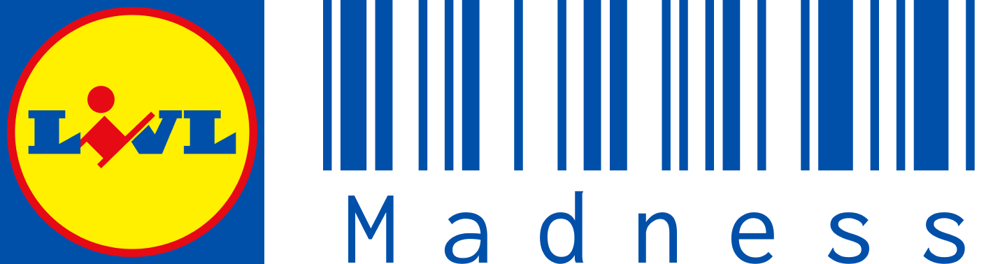

 
 
<h1 align="center">
  
  Livl Madness
</h1>

In Livl Madness you are gonna scan products in the madness of a Livl store ! 🎮

[Livl Madness website](https://livl.franck-g.fr/)

🇫🇷 Ce readme est aussi disponible en français [juste ici](./doc/README_FR.md) !

# Table of contents

- [🎮 Game specification](#Game-specification)
- [🕹️ How to play ?](#How-to-play-?)
  - [🙋 Play in solo](#Play-in-solo)
  - [🏚️ Play in local multiplayer](Play-in-local-multiplayer)
  - [🌍 Play in multiplayer over the internet](#Play-in-multiplayer-over-the-internet)
- [⚙️ Technical Specification](#Technical-Specification)
- [💖 Credits](#Credits)

# Game specification

## Objective

Players must compete against each other to scan as much product as possible in a limited time. They share the same shopping list and the same products. The player who scans the most products wins.

## Game rules

Each party lasts 3 minutes.

Each player in the Livl store share the same product list. When a player scan a product, it is removed from the list. When a product is scanned, it is marked as "Out of stock" for some times.

When a player scan a product, he win one point. If he scan the wrong product, he loose one point.

This is a multiplayer game, but you can also play in solo if you do not have any Livl fan friends around you.

## System requirement

We are providing client for both Windows, Linux and MacOsx operating system.

We are providing server for Windows and Linux operating system.

More informations about theses in the [how to play](#How-to-play-?) section.

# How to play ?

Firstly, you need to download your client or server build on our [Release page](https://github.com/Livl-Corporation/livl-madness/releases).

## Play in solo

To play in solo, you simply need to download the client for your operating system and run it.
Then start a party and enjoy !

## Play in local multiplayer

To play in multiplayer using your local network be sure that all the player computer are connected to the same network.

The host player must start the game, enter his nickname and click on "Héberger une partie". The host player must then share his local IP address to the other players.

To get your local IP address, you can use the `ipconfig` command on Windows or `ifconfig` on Linux in your terminal. Then share the IPv4 address to the other players.

The other player need to click on the gear button on the top right of the screen and enter the host IP address.
Then choose a nickname and click on "Rejoindre une partie".

## Play in multiplayer over the internet

To play accross the internet, you need to have a server running on a computer connected to the internet.

It can be a dedicated server build, or via the game client, by choosing "Héberger une partie" after entering your nickname.

You can download the server build on our [Release page](https://github.com/Livl-Corporation/livl-madness/releases)

To start the server, simply run the executable.

The port of the game is the default miror port `7778`. You need to open this port on your router and configure it correctly to allow players to connect to your server.

Once the server is running, you can share your [public IP](https://whatismyipaddress.com/) address to the players.

## Troubleshooting

If by any chance, there is an issue when you start your game _(scan not working, crashing etc...)_, especially if this is the second game you play, do not esitate to restart EVERYTHING (client & server)...

# Technical Specification

## Game development

The game is developped using [Unity](https://unity.com/fr) as game engine, and [Mirror](https://mirror-networking.com/) to manage the multiplayer aspect, with pain... Now you know why the game is called Livl Madness !

## Assets

Almost all the product assets in the game has been done by hand with [Blender](https://www.blender.org/) by taking pictures of real products in Eckbolsheim Livl store. Thanks to our photographer who has his gallery full of product wonderfull product pictures !

# Credits

Here are our four Livl enineer who worked on this wonderful project ! Do not hesitate them to thanks them for their hard work and dedication to this amazing project !

<table align="center">
  <tr>
    <th> <strong>@FranckG28</strong></th>
    <th> <strong>@jvondermarck</strong></th>
    <th> <strong>@Augustin68</strong></th>
    <th> <strong>@Kayn017</strong></th>
  </tr>
  <tr align="center">
    <td><b><a href="https://github.com/FranckG28" style="color: white">Franck Gutmann</a></b></td>
    <td><b><a href="https://github.com/jvondermarck" style="color: white">Julien Von Der Marck</a></b></td>
    <td><b><a href="https://github.com/Augustin68" style="color: white">Raffael Di Pietro</a></b></td>
    <td><b><a href="https://github.com/Kayn017" style="color: white">Tanguy Gimenez</a></b></td>
  </tr>
</table>
